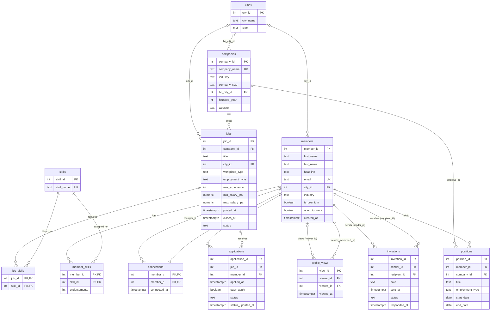

```mermaid
erDiagram
    cities {
        int city_id PK
        text city_name
        text state
    }

    skills {
        int skill_id PK
        text skill_name UK
    }

    companies {
        int company_id PK
        text company_name UK
        text industry
        text company_size
        int hq_city_id FK
        int founded_year
        text website
    }

    members {
        int member_id PK
        text first_name
        text last_name
        text headline
        text email UK
        int city_id FK
        text industry
        boolean is_premium
        boolean open_to_work
        timestamptz created_at
    }

    positions {
        int position_id PK
        int member_id FK
        int company_id FK
        text title
        text employment_type
        date start_date
        date end_date
    }

    member_skills {
        int member_id PK, FK
        int skill_id PK, FK
        int endorsements
    }

    connections {
        int member_a PK, FK
        int member_b PK, FK
        timestamptz connected_at
    }

    invitations {
        int invitation_id PK
        int sender_id FK
        int recipient_id FK
        text note
        timestamptz sent_at
        text status
        timestamptz responded_at
    }

    jobs {
        int job_id PK
        int company_id FK
        text title
        int city_id FK
        text workplace_type
        text employment_type
        int min_experience
        numeric min_salary_lpa
        numeric max_salary_lpa
        timestamptz posted_at
        timestamptz closes_at
        text status
    }

    job_skills {
        int job_id PK, FK
        int skill_id PK, FK
    }

    applications {
        int application_id PK
        int job_id FK
        int member_id FK
        timestamptz applied_at
        boolean easy_apply
        text status
        timestamptz status_updated_at
    }

    profile_views {
        int view_id PK
        int viewer_id FK
        int viewed_id FK
        timestamptz viewed_at
    }

    cities |o--o{ companies : "hq_city_id"
    cities |o--o{ members : "city_id"
    cities |o--o{ jobs : "city_id"

    companies ||--o{ positions : "employs_at"
    companies ||--o{ jobs : "posts"

    members ||--o{ positions : "holds"
    members ||--o{ applications : "submits"
    members ||--o{ invitations : "sends (sender_id)"
    members ||--o{ invitations : "receives (recipient_id)"
    members |o--o{ profile_views : "views (viewer_id)"
    members ||--o{ profile_views : "viewed_in (viewed_id)"

    members ||--o{ member_skills : "has"
    skills ||--o{ member_skills : "assigned_to"

    jobs ||--o{ job_skills : "requires"
    skills ||--o{ job_skills : "listed_in"

    members ||--o{ connections : "member_a"
    members ||--o{ connections : "member_b"

    jobs ||--o{ applications : "receives"
```
